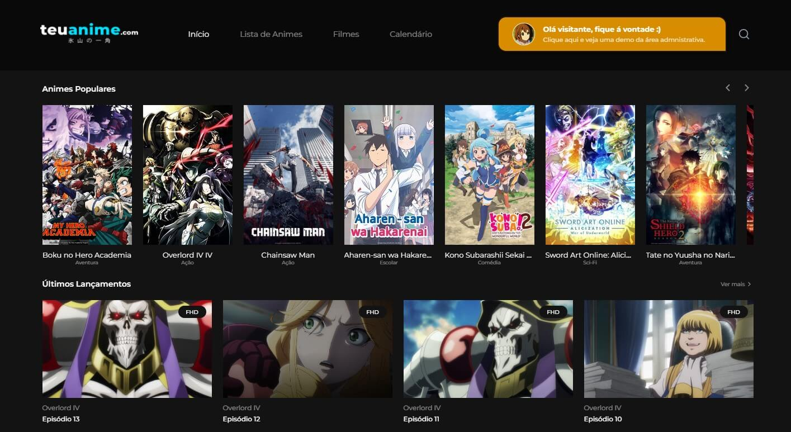

# TeuAnime - Front-end

Bem-vindo ao repositório do front-end do TeuAnime, um projeto de site de animes incrível! Este repositório contém o código-fonte e os recursos necessários para a interface de usuário do TeuAnime, onde os fãs de anime podem explorar informações sobre seus animes favoritos, assistir a trailers, ler e escrever comentários e muito mais.

## Visão Geral

O TeuAnime é um site voltado para os amantes de anime que desejam uma plataforma única para:

-   Assistir a trailers e clipes de animes.
-   Ler comentários e classificações de outros fãs de anime.

Este repositório abriga o código que alimenta a interface de usuário do TeuAnime. Ele foi construído usando tecnologias web modernas, incluindo HTML, CSS e JavaScript, e pode ser integrado a um back-end para fornecer dados e funcionalidades necessárias.

### Por que Contribuir?

-   **Aprimoramento das Habilidades**: Se você é um desenvolvedor e assim como eu busca um projeto menos genérico para aprimorar seu conhecimento, o TeuAnime é o lugar ideal para você.

### Recursos que Podem ser Adicionados

O TeuAnime é um projeto simples mas que está sempre aberto a novas ideias e contribuições. Aqui estão algumas features que podem ser adicionadas:

-   **Sistema de Usuários**: Com uma interface que permite que os usuários criem contas para personalizar suas experiências, marcar animes favoritos e exibir um registro de comentários recentes.

-   **Listas de Favoritos**: Uma guia para os usuários criar e gerenciar listas personalizadas de animes favoritos.

Caso se interesse em fazer alterações para esse projeto, sinta-se a vontade para criar um fork desse repositório e enviar as alterações desejadas via pull request. Agradecemos pela sua ajuda! 😁

### Links Úteis

-   **[Acesse o Projeto Online](https://projetos.arthurdev.website/teuanime/)**: Experimente o TeuAnime em ação! O projeto está hospedado e disponível para visualização online.

-   **[Visualize o Projeto no Figma](https://www.figma.com/file/I7SbSwrzC1bg6q7LJgU0bI/teuanime.com?node-id=0%3A1)**: Dê uma olhada no design do Figma para ter uma ideia visual do projeto.
